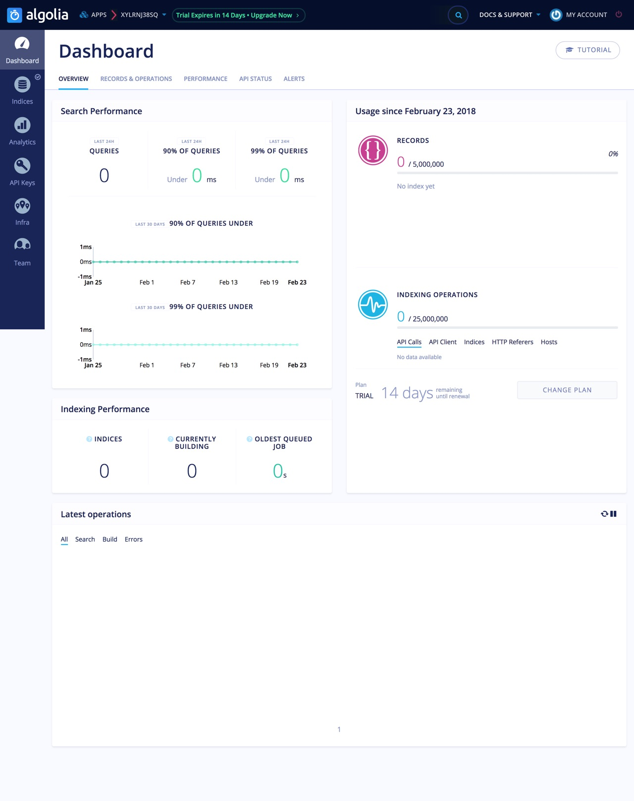
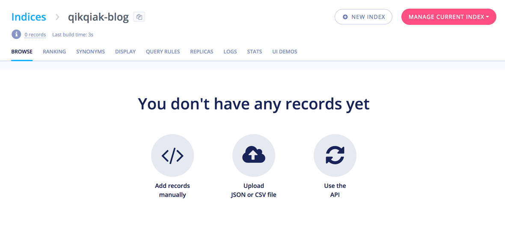
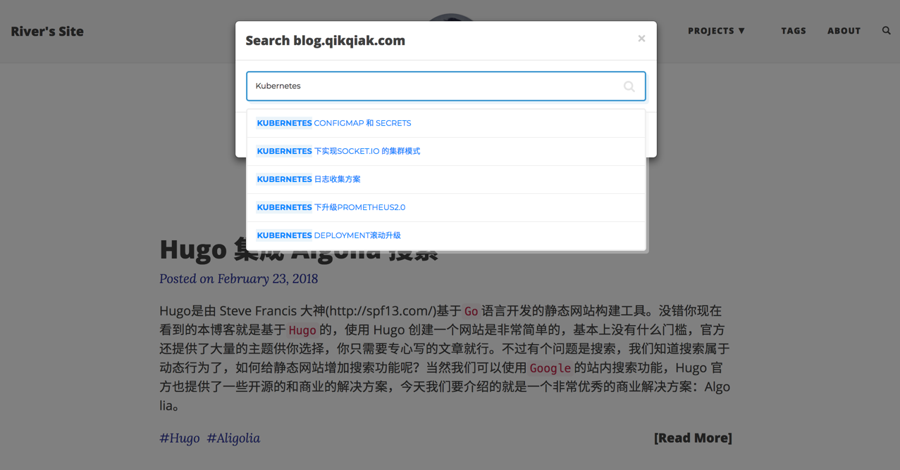

# 站内搜索插件

[Hugo](https://gohugo.io/)是由 Steve Francis 大神([http://spf13.com/](http://spf13.com/))基于`Go`语言开发的静态网站构建工具。没错你现在看到的本博客[<blog.qikqiak.com>](https://blog.qikqiak.com/)就是基于`Hugo`的，使用 Hugo 创建一个网站是非常简单的，基本上没有什么门槛，官方还提供了大量的主题供你选择，你只需要专心写的文章就行。不过有个问题是搜索，我们知道搜索属于动态行为了，如何给静态网站增加搜索功能呢？当然我们可以使用`Google`的站内搜索功能，Hugo 官方也提供了一些开源的和商业的解决方案，今天我们要介绍的就是一个非常优秀的商业解决方案：[Algolia](https://www.algolia.com/)。

## 简介
[Algolia](https://www.algolia.com/)是为你的 APP 或者网站添加搜索的最佳方式。 开发人员可以使用 API 上传并同步希望搜索的数据，然后可以进行相关的配置，比如产品转化率等等。可以使用 InstantSearch 等前端框架进行自定义搜索，为用户创造最佳的搜索体验。

## 注册
前往官方网站[https://www.algolia.com/](https://www.algolia.com/) 使用 GitHub 或 Google 帐号登录。登录完成后根据提示信息填写一些基本的信息即可，注册完成后前往 [Dashboard](https://www.algolia.com/dashboard)，我们可以发现 Algolia 会默认给我们生成一个 app。


选择 Indices，添加一个新的索引，我们这里命名为`qikqiak-blog`，创建成功后，我们可以看到提示中还没有任何记录。

Algolia 为我们提供了三种方式来增加记录：手动添加、上传 json 文件、API。我们这里使用第三种方式来进行数据的添加。

## 插件
要使用 API 的方式来添加搜索的数据，我们可以自己根据 Algolia 提供的 [API 文档](https://www.algolia.com/doc/api-reference/)进行开发，这也是很容易的，为简单起见，我们这里使用一个`hugo-algolia`的插件来完成我们的数据同步工作。

> 要安装`hugo-aligolia`我们需要先确保我们已经安装了 npm 或者 yarn 包管理工具。

使用下面的命令安装即可：
```shell
$ npm install hugo-algolia -g
```

安装完成后，在我们 hugo 生产的静态页面的根目录下面新建一个`config.yaml`的文件(和`config.toml`同级)，然后在`config.yaml`文件中指定 `Algolia`相关的 API 数据。
```yaml
---
baseurl: "/"
DefaultContentLanguage: "zh-cn"
hasCJKLanguage: true
languageCode: "zh-cn"
title: "River's Site"
theme: "beautifulhugo"
metaDataFormat: "yaml"
algolia:
  index: "qikqiak-blog"
  key: "3f541d53f128036d7542f6f2362d4a67"
  appID: "XYLRNJ38SQ"
---
```

> API 相关数据可以前往 dashboard 的 `API Keys`查看，注意上面的`key`是**Admin API Key**。

配置完成以后，在根目录下面执行下面的命令：
```shell
$ hugo-algolia -s
JSON index file was created in public/algolia.json
{ updatedAt: '2018-02-23T02:36:09.480Z', taskID: 249063848950 }
```
然后我们可以看到，上面命令执行完成后会在`public`目录下面生成一个`algolia.json`的文件。这个时候我们在 dashboard 中打开 Indices，可以看到已经有几十条数据了。


> 如果某篇文章不想被索引的话，我们只需要在文件的最前面设置 index 参数为 false 即可，`hugo-algolia`插件在索引的过程中会自动跳过它。

## 前端
现在我们将需要被搜索的文章数据已经成功提交到`Algolia`，接下来的事情就是前端页面的展示了。下面的操作对于不同的主题或许有不同的地方，请根据自己的实际情况进行相应的修改。我这里使用的是`beautifulhugo`主题，在`themes/beautifulhugo/layouts/partials`目录下面新增文件：（**search.html**）
```html
<div class="aa-input-container" id="aa-input-container">
    <input type="search" id="aa-search-input" class="aa-input-search" placeholder="Search for titles or URIs..." name="search" autocomplete="off" />
    <svg class="aa-input-icon" viewBox="654 -372 1664 1664">
        <path d="M1806,332c0-123.3-43.8-228.8-131.5-316.5C1586.8-72.2,1481.3-116,1358-116s-228.8,43.8-316.5,131.5  C953.8,103.2,910,208.7,910,332s43.8,228.8,131.5,316.5C1129.2,736.2,1234.7,780,1358,780s228.8-43.8,316.5-131.5  C1762.2,560.8,1806,455.3,1806,332z M2318,1164c0,34.7-12.7,64.7-38,90s-55.3,38-90,38c-36,0-66-12.7-90-38l-343-342  c-119.3,82.7-252.3,124-399,124c-95.3,0-186.5-18.5-273.5-55.5s-162-87-225-150s-113-138-150-225S654,427.3,654,332  s18.5-186.5,55.5-273.5s87-162,150-225s138-113,225-150S1262.7-372,1358-372s186.5,18.5,273.5,55.5s162,87,225,150s113,138,150,225  S2062,236.7,2062,332c0,146.7-41.3,279.7-124,399l343,343C2305.7,1098.7,2318,1128.7,2318,1164z" />
    </svg>
</div>
<script src="{{ "https://res.cloudinary.com/jimmysong/raw/upload/rootsongjc-hugo/algoliasearch.min.js" | absURL }}"></script>
<script src="{{ "https://res.cloudinary.com/jimmysong/raw/upload/rootsongjc-hugo/autocomplete.min.js" | absURL }}"></script>
<script>
var client = algoliasearch("XYLRNJ38SQ", "3f541d53f128036d7542f6f2362d4a67");
var index = client.initIndex('qikqiak-blog');
autocomplete('#aa-search-input',
{ hint: false}, {
    source: autocomplete.sources.hits(index, {hitsPerPage: 8}),
    displayKey: 'name',
    templates: {
        suggestion: function(suggestion) {
            console.log(suggestion);
            return '<span>' + '<a href="/post/' + suggestion.slug + '">' +
            suggestion._highlightResult.title.value + '</a></span>';
        }
    }
});
</script>
```
注意上面 JS 代码：
```javascript
var client = algoliasearch("XYLRNJ38SQ", "3f541d53f128036d7542f6f2362d4a67");
var index = client.initIndex('qikqiak-blog');
```

> 其中`algoliasearch`的第一个参数为`Application ID`，第二个参数为`Search-Only API Key`，下面的`initIndex`方法的参数为我们创建的索引名称`qikqiak-blog`。

然后我们只需要添加一个搜索入口即可，在`themes/beautifulhugo/layouts/partials/nav.html`文件最下面添加如下代码：
```html
<div id="modalSearch" class="modal fade" role="dialog">
    <div class="modal-dialog">
      <div class="modal-content">
        <div class="modal-header">
          <button type="button" class="close" data-dismiss="modal">&times;</button>
          <h4 class="modal-title">Search blog.qikqiak.com</h4>
        </div>
        <div class="modal-body">
            {{ partial "search.html" . }}
        </div>
        <div class="modal-footer">
          <button type="button" class="btn btn-default" data-dismiss="modal">close</button>
        </div>
      </div>
    </div>
</div>
```
其中最重要的代码是引入上面我们新建的`search.html`文件。剩下的就是一些美化搜索页面的工作，新建`themes/beautifulhugo/static/css/search.css`文件：
```css
@import 'https://fonts.googleapis.com/css?family=Montserrat:400,700';
.aa-input-container {
  display: inline-block;
  position: relative;
  width: 100%;
}
.aa-input-container span,.aa-input-container input {
    width: inherit;
}
.aa-input-search {
  width: 300px;
  padding: 12px 28px 12px 12px;
  border: 2px solid #e4e4e4;
  border-radius: 4px;
  -webkit-transition: .2s;
  transition: .2s;
  font-family: "Montserrat", sans-serif;
  box-shadow: 4px 4px 0 rgba(241, 241, 241, 0.35);
  font-size: 11px;
  box-sizing: border-box;
  color: #333;
  -webkit-appearance: none;
  -moz-appearance: none;
  appearance: none;
}
.aa-input-search::-webkit-search-decoration, .aa-input-search::-webkit-search-cancel-button, .aa-input-search::-webkit-search-results-button, .aa-input-search::-webkit-search-results-decoration {
    display: none;
}
.aa-input-search:focus {
    outline: 0;
    border-color: #3a96cf;
    box-shadow: 4px 4px 0 rgba(58, 150, 207, 0.1);
}
.aa-input-icon {
  height: 16px;
  width: 16px;
  position: absolute;
  top: 50%;
  right: 16px;
  -webkit-transform: translateY(-50%);
          transform: translateY(-50%);
  fill: #e4e4e4;
}
.aa-hint {
  color: #e4e4e4;
}
.aa-dropdown-menu {
  background-color: #fff;
  border: 2px solid rgba(228, 228, 228, 0.6);
  border-top-width: 1px;
  font-family: "Montserrat", sans-serif;
  width: 300px;
  margin-top: 10px;
  box-shadow: 4px 4px 0 rgba(241, 241, 241, 0.35);
  font-size: 11px;
  border-radius: 4px;
  box-sizing: border-box;
}
.aa-suggestion {
  padding: 12px;
  border-top: 1px solid rgba(228, 228, 228, 0.6);
  cursor: pointer;
  -webkit-transition: .2s;
  transition: .2s;
  display: -webkit-box;
  display: -ms-flexbox;
  display: flex;
  -webkit-box-pack: justify;
      -ms-flex-pack: justify;
          justify-content: space-between;
  -webkit-box-align: center;
      -ms-flex-align: center;
          align-items: center;
}
.aa-suggestion:hover, .aa-suggestion.aa-cursor {
    background-color: rgba(241, 241, 241, 0.35);
}
.aa-suggestion > span:first-child {
    color: #333;
}
.aa-suggestion > span:last-child {
    text-transform: uppercase;
    color: #a9a9a9;
}
.aa-suggestion > span:first-child em, .aa-suggestion > span:last-child em {
  font-weight: 700;
  font-style: normal;
  background-color: rgba(58, 150, 207, 0.1);
  padding: 2px 0 2px 2px;
}
```
当然还得在页面中引入上面的 CSS 样式文件，在文件`themes/beautifulhugo/layouts/partials/head.html`的**head**区域添加如下代码：
```html
<link rel="stylesheet" href="{{ "css/search.css" | absURL }}" />
```

## 搜索
上面的所有工作完成后，我们重新生成静态页面，更新网站数据。我们可以看到导航栏最右边已经有了一个搜索按钮了。


## 参考资料
* [https://github.com/rootsongjc/beautifulhugo](https://github.com/rootsongjc/beautifulhugo)
* [https://gohugo.io/tools/search/](https://gohugo.io/tools/search/)
* [https://www.npmjs.com/package/hugo-algolia](https://www.npmjs.com/package/hugo-algolia)
* [https://blog.qikqiak.com/post/hugo-integrated-algolia-search/](https://blog.qikqiak.com/post/hugo-integrated-algolia-search/)

