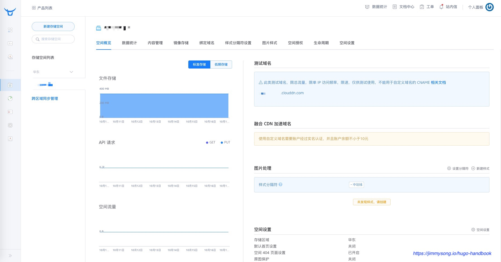
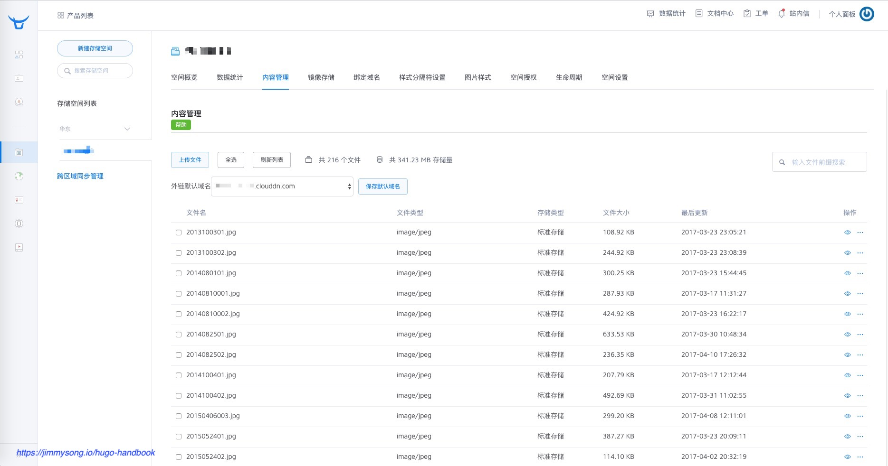
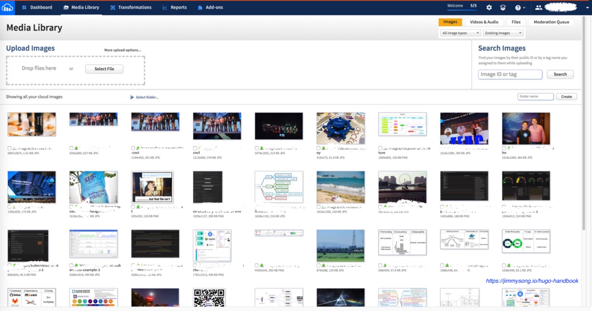
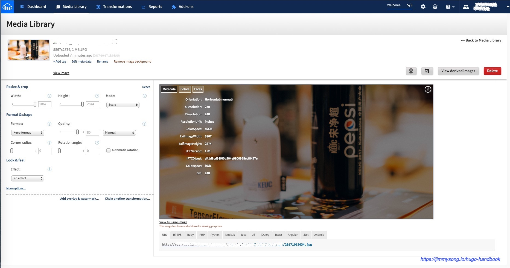

# 静态文件存储

我推荐将静态文件跟网站的代码、主题、主体文件分开存储，这样的好处是：

- 可以使用CDN加快静态文件的访问速度
- 单独管理静态文件，方便重复应用
- 可以使用其他工具对静态文件的使用和流量进行控制

## 云存储

我推荐使用如下两种云存储：

- 七牛云：https://www.qiniu.com
- Cloudinary: https://www.cloudinary.com

我将分别介绍两种云储存服务，及其各自的优缺点：

### 七牛云存储

[七牛云](https://www.qiniu.com)是中国知名的云存储公司，提供对象存储、CDN和PaaS平台等企业级服务。

七牛云存储提供了免费CDN配额：存储空间10GB，每月下载流量10GB，每月PUT/DELETE 10万次请求，每月GET 100万次请求。月流量在10GB以下的网站基本上可以一直免费使用七牛云存储CDN服务。

七牛云可以通过API也可以直接通过Web上传文件和对文件进行简单的管理。

### Cloudinary

Cloudinary的免费套餐如下：

- **20,000 + 7,500 Extra** Monthly Transformations
- **300,000 + 300,000 Extra** Total Images
- **10 GB + 3 GB Extra** Managed Storage
- **20 GB + 6 GB Extra** Monthly Viewing Bandwidth

Extra的资源是通过facebook和Twitter给他们分享后获得的，这些免费资源基本可以满足一个普通博客的需求。

下图是媒体库，可以选择`图片`、`音视频`、`文件`、`中断队列`来对整个媒体库的内容进行分类。

点击单张图片进入详情页面，可以分别对每张图片进行操作，例如裁剪、增加水印、缩略图等。

## 对比

下面将从以下几个方面对两种云存储进行对比，供大家参考。

| 云储存     | 七牛云                                      | Cloudinary                               |
| ------- | ---------------------------------------- | ---------------------------------------- |
| 易用性     | 适应国内用户的操作习惯，提供命令行工具和众多的开源工具支持            | 纯英文界面，web操作不够友好，页面在国内访问比较慢，但是提供了多种语言的API支持，很多国外的博客管理软件默认使用的云存储，支持文件访问次数和访问来源等多种统计功能 |
| 免费额度    | 10G存储，每月10G流量                            | 13G存储、月26G流量、30万张图片、月27,500张图片转换         |
| https支持 | 需要自行设置证书，默认不支持，https流量需要单独计费，不提供免费https流量 | 默认支持https，不区分https和http流量                |
| 访问速度    | 国内用户访问速度极快                               | 访问速度很快，完全满足要求                            |
| 文件操作    | 没有文件的历史版本信息                              | 保留文件的历史版本，提供免费的图片转换额度                    |

因为cloudinary保存的文件默认支持https并且月流量为26G，远远大于七牛云，并且提供很很友好的图片引用和调用统计功能，因此我将原来在七牛云中的存储的文件迁移到了cloudinary中。